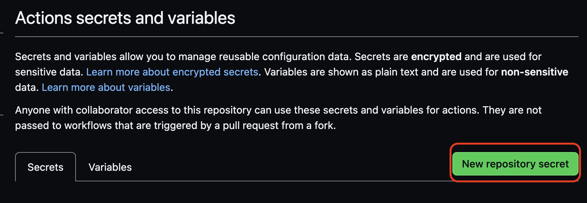
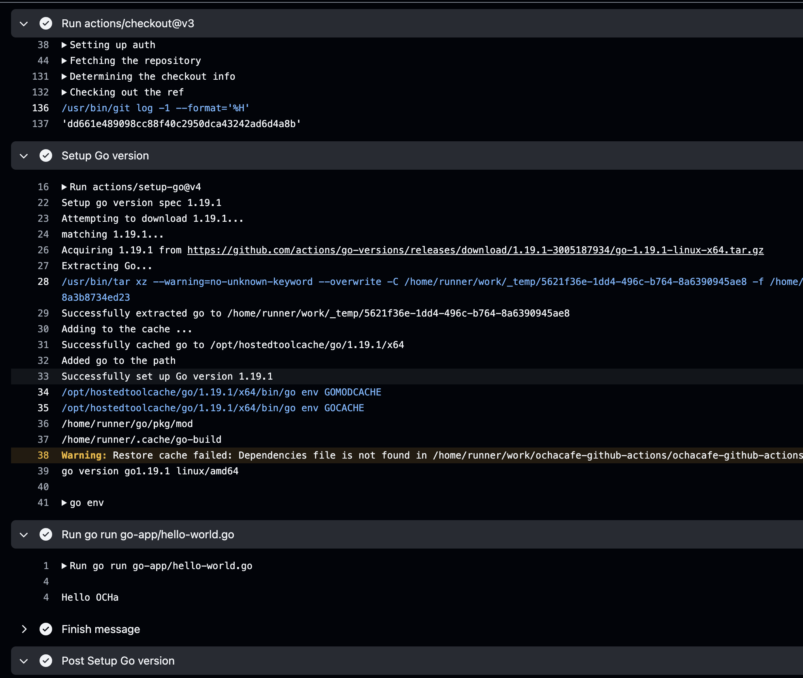
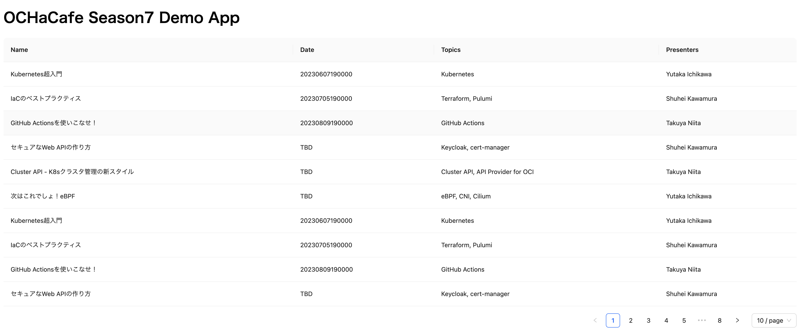
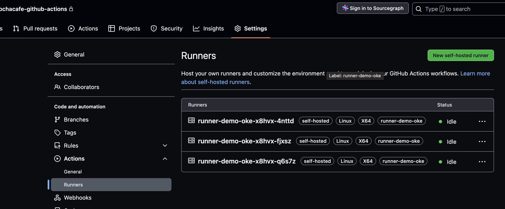
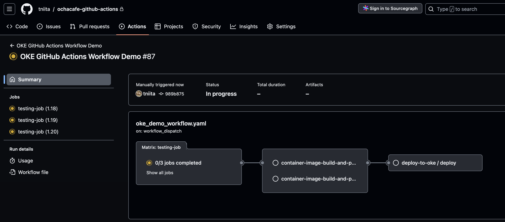

# ochacafe-github-actions

  

## Oracle Cloud Hangout Cafe Season7 #3 Get Started GitHub Actions!!

### Directory Configuration

```bash
.
├── README.md 
├── go-app  # Using a Simple Workflow Demo
│   └── hello-world.go
├── img
├── k8s # Actions Runnner Controller Manifest
│   ├── arc.yaml
│   └── demo.yaml
└── oke-app # Sample App for GitHub Actions Workflow Demo
    ├── backend-app
    │   ├── Dockerfile
    │   ├── crud
    │   │   └── crud.go
    │   ├── db
    │   │   └── db.go
    │   ├── go.mod
    │   ├── go.sum
    │   ├── http
    │   │   └── methods.go
    │   ├── main.go
    │   └── repo
    │       └── items.go
    └── frontend-app
        ├── Dockerfile
        ├── README.md
        ├── jsconfig.json
        ├── next.config.js
        ├── package-lock.json
        ├── package.json
        └── src
            └── pages
                ├── _app.js
                ├── _document.js
                ├── _error.js
                └── index.js

12 directories, 22 files
```

### GitHub Actions利用手順

#### レポジトリのfork

このレポジトリをforkしてください。


#### Secretの設定

サンプルアプリケーションをOracle Container Engine for Kubernetes（以下、OKE）にデプロイするための情報をGitHub Secretとして登録します。  

GitHub上部の`Settings`をクリックします。


`Secrets and variables`の`actions`をクリックします。


`New repository secret`をクリックします。  



以下のSecretを作成します。  

| 項目  | 設定内容 |
| ------------- | ------------- |
| OCI_CLI_FINGERPRINT  | [チュートリアル](https://oracle-japan.github.io/ocitutorials/intermediates/using-cli/)内で取得できるAPIキーのフィンガープリント  |
| OCI_CLI_KEY_CONTENT  | [チュートリアル](https://oracle-japan.github.io/ocitutorials/intermediates/using-cli/)内で取得できるAPIキーの秘密鍵  |
| OCI_CLI_REGION  | [チュートリアル](https://oracle-japan.github.io/ocitutorials/intermediates/using-cli/)内で取得できるAPIキーの秘密鍵  |
| OCI_CLI_TENANCY  | [チュートリアル](https://oracle-japan.github.io/ocitutorials/intermediates/using-cli/)内で取得できるテナンシOCID  |
| OCI_CLI_USER  | [チュートリアル](https://oracle-japan.github.io/ocitutorials/intermediates/using-cli/)内で取得できるユーザのOCID  |
| OKE_CLUSTER_OCID  | [チュートリアル](https://oracle-japan.github.io/ocitutorials/cloud-native/oke-for-commons/)で取得できるクラスタOCID  |

これでSecretの作成は完了です。

#### MySQL Database Serviceのプロビジョニング

以降のサンプルアプリケーションで利用するMySQL Database Serviceをプロビジョニングします。  
プロビジョニングは[チュートリアル](https://oracle-japan.github.io/ocitutorials/beginners/creating-mds/)をご確認ください。  
なお、プロビジョニングに利用するVCNはOKEと同一のVCNを利用してください。  

プロビジョニング時に指定した`ユーザ名`、`パスワード`、`IPアドレス`をメモしておきます。  

以下のコマンドでMySQL Database Serviceに接続するためのKubernetes Secretをdefault namespaceに作成します。  

```sh
kubectl create secret generic db-secret --from-literal=username=<ユーザ名> --from-literal=password=<パスワード> --from-literal=host=<IPアドレス>
```

これでMySQL Database Serviceのプロビジョニングは完了です。  

#### 動作確認

動作確認をします。

サンプルデモは2種類あるので、それぞれ説明します。  

##### Simple Workflow Demo

`Simple Workflow Demo`用のサンプルアプリケーションは、`go-app`配下に存在します。
このアプリケーションは`Hello World`を標準出力するシンプルなソースコードです。

`Simple Workflow Demo`は以下の通り、mainレポジトリにPushすると動作する設定になっています。  

```yaml
name: Simple Demo

on:
  push:
    paths:
      - "go-app/**"
  workflow_dispatch:

jobs:
  build:
    runs-on: ubuntu-latest
    steps:
      - name: Start message
        run: echo "Welcome to GitHub Actions"
      - uses: actions/checkout@v3
      - name: Setup Go version
        uses: actions/setup-go@v4
        with:
          go-version: "1.19.1"
      - run: go run go-app/hello-world.go
      - name: Finish message
        run: echo "Finished running the demo"
```

Workflowの中身は、以下の通りです。  

1. 開始メッセージを出力
2. レポジトリをチェックアウト
3. Go v1.19.1で実行
4. 終了メッセージを出力

Goファイルの中身は以下のようになっています。  

```go
package main

import "fmt"

func main() {
	fmt.Printf("Hello World \n")
}
```

例えば、以下のように変更してPushします。  

```go
func main() {
	fmt.Printf("Hello OCHa \n")
}
```

Pushすると、GitHub Actionsが動作します。  


結果を見てみると以下のようになります。  



これで`Simple Workflow Demo`のデモは完了です。  

##### GitHub Actions Workflow Demo

`GitHub Actions Workflow Demo`用のサンプルアプリケーションは、`oke-app`配下に存在します。  
このアプリケーションはフロントエンドはNext.jsアプリ、バックエンドはGoアプリです。  

このWorkflowは以下の機能を利用したものになります。

- マトリクス戦略
- Cache
- Reusable Workflow
- サービスコンテナ
- GitHub Packages
- GitHub Secrets

このWorkflowの流れは大きく以下の通りです。


4つのジョブから構成されています。

ジョブ1:**マトリクス戦略**により、Goの3バージョンで並列に実行、MySQLの**サービスコンテナ**を利用してテストを実施  
ジョブ2,ジョブ3: 並列にGoアプリとNext.jsアプリのコンテナイメージをビルドし、**GitHub Packages**の一部であるGitHub Container RegistryにPush、ビルドの際には**Cache**を利用してビルド時間を短縮  
ジョブ4: **Reusable Workflow**として実行、**GitHub Secrets**に格納された情報をもとにOracle Container Engine for Kubernetesにアプリをデプロイ

`GitHub Actions Workflow Demo`は`oke-app`配下のいずれかのファイルの更新によりトリガーされます。  

ここでは、`oke-app/backend-app/db/db.go`に定義されたテーブル情報を更新してみましょう。  
このテーブル情報はアプリ起動時にMySQLに対して書き込みされます。 

現状は以下のようになっています。  

```go
		{
			Name:       "Kubernetes超入門",
			Date:       time.Date(2023, 6, 7, 19, 00, 00, 000000, time.UTC).Format("20060102150405"),
			Topics:     "Kubernetes",
			Presenters: "Yutaka Ichikawa",
		},
		{
			Name:       "IaCのベストプラクティス",
			Date:       time.Date(2023, 7, 5, 19, 00, 00, 000000, time.UTC).Format("20060102150405"),
			Topics:     "Terraform, Pulumi",
			Presenters: "Shuhei Kawamura",
		},
		{
			Name:       "GitHub Actionsを使いこなせ！",
			Date:       time.Date(2023, 8, 9, 19, 00, 00, 000000, time.UTC).Format("20060102150405"),
			Topics:     "GitHub Actions",
			Presenters: "Takuya Niita",
		},
		{
			Name:       "セキュアなWeb APIの作り方",
			Date:       time.Date(2023, 9, 6, 19, 00, 00, 000000, time.UTC).Format("20060102150405"),
		    Topics:     "Keycloak, cert-manager",
			Presenters: "Shuhei Kawamura",
		},
		{
			Name:       "Cluster API - K8sクラスタ管理の新スタイル",
			Date:       "TBD",
			Topics:     "Cluster API, API Provider for OCI",
			Presenters: "Takuya Niita",
		},
		{
			Name:       "次はこれでしょ！eBPF",
			Date:       "TBD",
			Topics:     "eBPF, CNI, Cilium",
			Presenters: "Yutaka Ichikawa",
		},
```

`セキュアなWeb APIの作り方`は日程が`2023/9/6`と決まっているので、以下のように更新します。  

```go
		{
			Name:       "セキュアなWeb APIの作り方",
			Date:       time.Date(2023, 9, 6, 19, 00, 00, 000000, time.UTC).Format("20060102150405"),
			Topics:     "Keycloak, cert-manager",
			Presenters: "Shuhei Kawamura",
		},
```

Pushすると、GitHub Actionsが動作します。  


デプロイされると以下のようなアプリケーションがOKEにデプロイされます。  



ビルドされたコンテナはGitHub PackagesにPushされているので、以下で確認できます。　　


コンテナイメージなどのCacheについては以下から確認できます。  


これで`GitHub Actions Workflow Demo`のデモは完了です。  

### [option]Actions Runnner Controller利用手順

ここでは、Actions Runnner Controllerを利用する手順を説明します。  

> **Warning**
> この手順を実施する場合はセキュリティ確保のため、必ずプライベートレポジトリで実施してください。

Actions Runnner Controllerを利用する場合は、事前準備として[こちら](https://github.com/actions/actions-runner-controller/blob/master/docs/authenticating-to-the-github-api.md)を実施してください。  

以下のManifestをデプロイします。  

```sh
kubectl apply -f k8s/arc.yaml
```

デプロイすると以下のようにPodが作成されます。  

```yaml
$ kubectl get pods -n actions-runner-system cert-manager default
NAMESPACE               NAME                                            READY   STATUS    RESTARTS        AGE
actions-runner-system   controller-manager-5f468ff884-hl6pp             2/2     Running   2 (2d14h ago)   10d
cert-manager            cert-manager-bfcd95fbc-h9n77                    1/1     Running   0               10d
cert-manager            cert-manager-cainjector-6c65c9f988-d49q2        1/1     Running   0               10d
cert-manager            cert-manager-webhook-78b75fb78f-jtclh           1/1     Running   0               10d
default                 runner-demo-oke-x8hvx-4nttd                     2/2     Running   0               10d
default                 runner-demo-oke-x8hvx-fjxsz                     2/2     Running   0               10d
default                 runner-demo-oke-x8hvx-q6s7z                     2/2     Running   0               10d
```

`runner-demo-oke-xxx`がそれぞれGitHub Actionsのランナーの役割を果たすPodです。 

これはGitHubのUIからでも確認できます。  



上記でデプロイしたManifestでは、`runnner-demo-oke`というラベルを付与しています。    

```yaml
apiVersion: actions.summerwind.dev/v1alpha1
kind: RunnerDeployment
metadata:
  name: runner-demo-oke
spec:
  template:
    spec:
      repository: tniita/ochacafe-github-actions
      labels:
        - runner-demo-oke
      resources:
        limits:
          cpu: "1.0"
          memory: "4Gi"
        requests:
          cpu: "1.0"
          memory: "4Gi"
```

GitHub Actionsの定義ファイル(YAMLファイル)ではこちらのラベルを利用します。
`.github/workflows/oke_demo_workflow.yaml`と`.github/workflows/oke_demo_deploy.yaml`をそれぞれ変更します。  

```yaml
jobs:
  testing-job:
    runs-on: runnner-demo-oke　 # 各Jobの`runs-on`を`runnner-demo-oke`に変更
    strategy:
      matrix:
        go-version: ["1.18", "1.19", "1.20"]
```

これで準備完了です。  

今回は、手動で`OKE GitHub Actions Workflow Demo`を実行してください。  


JobがOKEのPodで実行されていることが確認できます。





